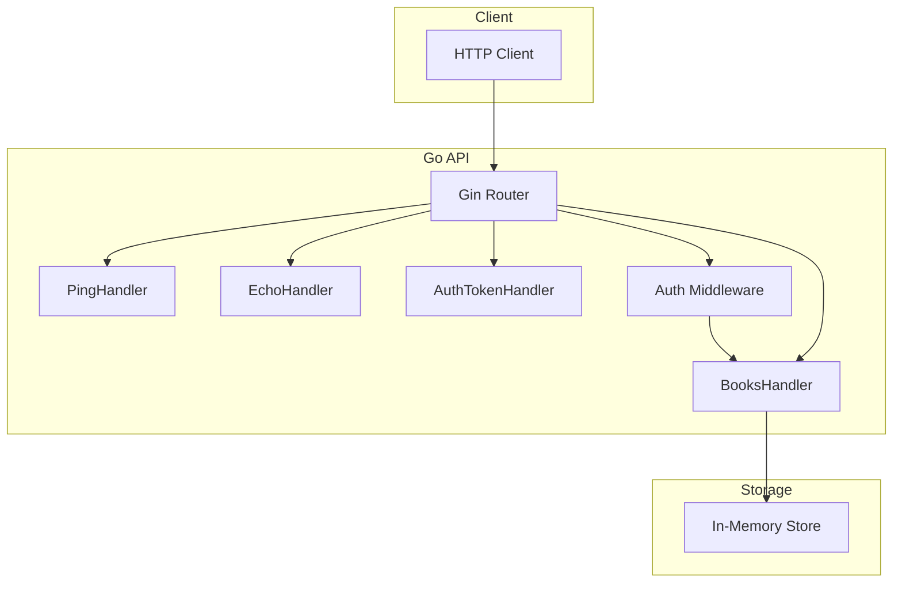
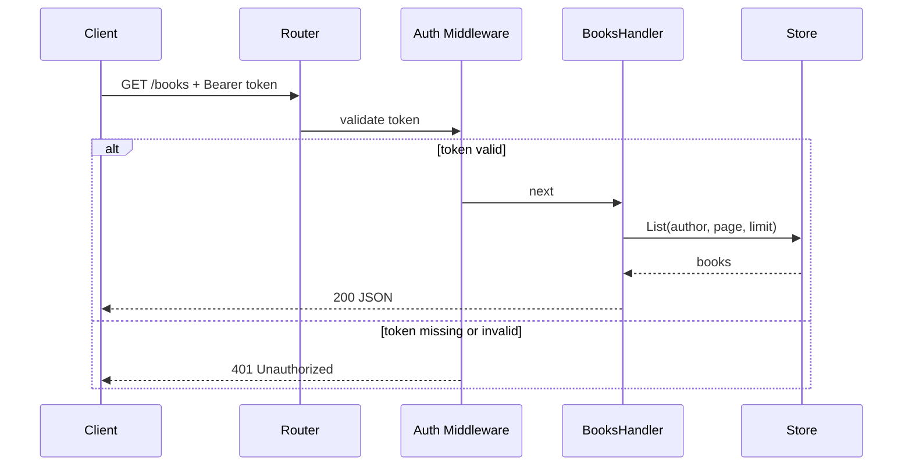

# API Quest – Backend Challenge

A REST API built in **Go** with the **Gin** framework for the 8-level API Quest challenge. It provides ping, echo, full CRUD for books (with auth guard), search, pagination, and error handling. Data is kept in a **thread-safe in-memory store**—no database required. Designed to run locally or on [Render](https://render.com) with minimal setup.

---

## Brief description

This service implements all 8 challenge levels in order: a simple health check and echo, then book CRUD with create/read/update/delete, token-based auth protecting `GET /books`, author filter and pagination, proper 400/404 responses, and a final “speed run” over all endpoints. Auth uses a fixed credential pair (`admin` / `password`) and a static Bearer token for the guarded route. The app listens on `PORT` (default `8080`) and is ready for Render’s free tier via the included Dockerfile and `render.yaml`.

---

## Architecture (UML-style)

High-level structure: router, handlers, middleware, and in-memory store.



Request flow for a protected `GET /books` (with auth):



---

## Endpoints

- **Level 1:** `GET /ping` – returns `{"message":"pong"}`
- **Level 2:** `POST /echo` – returns the request JSON body as-is
- **Level 3–4:** `POST /books`, `GET /books`, `GET /books/:id`, `PUT /books/:id`, `DELETE /books/:id`
- **Level 5:** `POST /auth/token` (body: `username`, `password`; use `admin` / `password`), `GET /books` (requires `Authorization: Bearer <token>`)
- **Level 6:** `GET /books?author=X&page=1&limit=2` – filter by author and paginate
- **Level 7:** 400 on invalid body, 404 for unknown book ID
- **Level 8:** All of the above in sequence

---

## Run locally

```bash
go run .
# or
PORT=8080 go run .
```

## Test

```bash
go test ./... -v -race
```

---

## How to deploy on Render

1. **Push this repo to GitHub**  
   Create a new repository and push the code (including `Dockerfile` and `render.yaml`).

2. **Sign in to Render**  
   Go to [render.com](https://render.com) and sign in (GitHub login is easiest).

3. **Create a new Web Service**  
   - Dashboard → **New +** → **Web Service**.  
   - Connect your GitHub account if needed and select the repo that contains this project.  
   - Render will detect the Dockerfile; leave **Environment** as **Docker**.  
   - Set a **Name** (e.g. `api-quest`).  
   - **Region**: choose one close to you.  
   - **Branch**: usually `main`.  
   - Click **Create Web Service**.

4. **First deploy**  
   Render builds the image from the Dockerfile and runs the app. Wait until the deploy shows **Live**. The URL will look like `https://<service-name>.onrender.com`.

5. **Optional: Deploy hook for CI/CD**  
   - In the Render dashboard, open your service → **Settings** → **Deploy Hook**.  
   - Copy the deploy hook URL.  
   - In GitHub: repo → **Settings** → **Secrets and variables** → **Actions** → **New repository secret**.  
   - Name: `RENDER_DEPLOY_HOOK`, Value: the deploy hook URL.  
   - Pushes to `main` will then trigger a redeploy (see CI/CD section below).

6. **Use the base URL in the challenge**  
   Paste `https://<service-name>.onrender.com` (no trailing slash) as the API base URL in the API Quest challenge.

**Notes:**  
- Free tier services spin down after inactivity; the first request after idle may be slow.  
- The app reads `PORT` from the environment; Render sets this automatically.

---

## CI/CD

GitHub Actions workflow (`.github/workflows/ci.yml`):

- On every **push** and **pull_request**: run `go test ./... -v -race` and `go build`.
- On push to **main**: if the secret `RENDER_DEPLOY_HOOK` is set, the workflow calls that URL to trigger a Render deploy.

No deploy hook is required for manual deploys from the Render dashboard.
